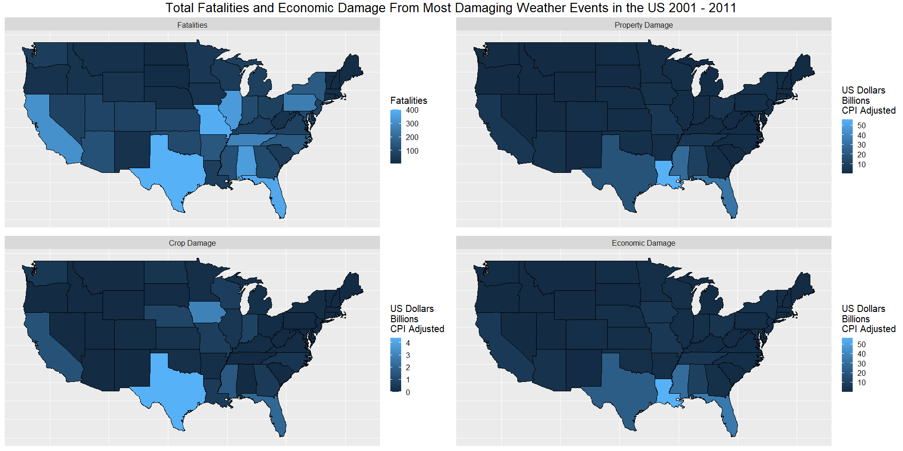

## Synopsis


Extreme weather events are a regular occurrence in the United States. In 2021 alone there were 20 'Billion-dollar disaster events' leading to 688 fatalities and causing $145 Billion in damage (NOAA, 2022). Being able to predict and better allocate resources to these events will enable the creation of data driven policies and protocols that could reduce this loss of life and economic damage as well as speeding up recovery. The aim of this report is to provide actionable insight into these events and give recommendations on how resources could be prioritized based on them. The analysis is part of an assignment for the John Hopkins University Reproducible Research course as part of their Data Science Specialization. The assignment asks the questions: Across the United States which types of events are most harmful with respect to population health and which events have the greatest economic consequences. This analysis will be using the US National Oceanic and Atmospheric Administration's (NOAA) storm database. The database tracks major storms and weather events across the United States, including when and where they occur along with estimates of any fatalities, injuries and property damage. The data can be downloaded from: https://d396qusza40orc.cloudfront.net/repdata%2Fdata%2FStormData.csv.bz2

## Data Processing


We first read in the data which is comma delimited keeping the header data.


```r
raw_data <- read_csv("repdata_data_StormData.csv.bz2")
```

```r
storm_data = raw_data
dim(storm_data)
```

```
## [1] 902297     37
```

```r
head(storm_data)
```

```
## # A tibble: 6 x 37
##   STATE__ BGN_DATE   BGN_TIME TIME_ZONE COUNTY COUNTYNAME STATE EVTYPE BGN_RANGE
##     <dbl> <chr>      <chr>    <chr>      <dbl> <chr>      <chr> <chr>      <dbl>
## 1       1 4/18/1950~ 0130     CST           97 MOBILE     AL    TORNA~         0
## 2       1 4/18/1950~ 0145     CST            3 BALDWIN    AL    TORNA~         0
## 3       1 2/20/1951~ 1600     CST           57 FAYETTE    AL    TORNA~         0
## 4       1 6/8/1951 ~ 0900     CST           89 MADISON    AL    TORNA~         0
## 5       1 11/15/195~ 1500     CST           43 CULLMAN    AL    TORNA~         0
## 6       1 11/15/195~ 2000     CST           77 LAUDERDALE AL    TORNA~         0
## # ... with 28 more variables: BGN_AZI <chr>, BGN_LOCATI <chr>, END_DATE <chr>,
## #   END_TIME <chr>, COUNTY_END <dbl>, COUNTYENDN <lgl>, END_RANGE <dbl>,
## #   END_AZI <chr>, END_LOCATI <chr>, LENGTH <dbl>, WIDTH <dbl>, F <dbl>,
## #   MAG <dbl>, FATALITIES <dbl>, INJURIES <dbl>, PROPDMG <dbl>,
## #   PROPDMGEXP <chr>, CROPDMG <dbl>, CROPDMGEXP <chr>, WFO <chr>,
## #   STATEOFFIC <chr>, ZONENAMES <chr>, LATITUDE <dbl>, LONGITUDE <dbl>,
## #   LATITUDE_E <dbl>, LONGITUDE_ <dbl>, REMARKS <chr>, REFNUM <dbl>
```

The data contains observations of 902297 events consisting of 37 features for each. We aren't interested in all of these features so we'll drop those that are not relevant to our high level analysis. We'll also make the column names lower case so they are easier to type.


```r
names(storm_data) <- tolower(names(storm_data))
storm_data <- subset(storm_data, select = -c(bgn_time, time_zone, bgn_range, bgn_azi, bgn_locati,
                                             end_date, end_time, county_end, countyendn, 
                                             end_range, end_azi, end_locati, f, mag, length, width,
                                             stateoffic, zonenames, latitude_e, longitude_,
                                             remarks, wfo))
```

The values for property and crop damage consist of a value column and a column denoting if the value is in thousands/millions etc. We'll condense these columns to dollar amounts.


```r
table(storm_data['propdmgexp'])
```

```
## 
##      -      ?      +      0      1      2      3      4      5      6      7 
##      1      8      5    216     25     13      4      4     28      4      5 
##      8      B      h      H      K      m      M 
##      1     40      1      6 424665      7  11330
```
I have made the assumption that B/M/K denote billion/million/thousand however without documentation on the others the safest cause of action is to drop the rows containing them. 


```r
storm_data <- storm_data %>%
  mutate(propdmgexp = tolower(propdmgexp), cropdmgexp = tolower(cropdmgexp)) %>%
  filter(propdmgexp %in% c("b", "m", "k", NA) & cropdmgexp %in% c("b", "m", "k", NA)) %>%
  mutate(propdmgexp = case_when(propdmgexp == "k" ~ 1000,
                                propdmgexp == "m" ~ 1000000,
                                propdmgexp == "b" ~ 1000000000,
                                is.na(propdmgexp) ~ 1),
         cropdmgexp = case_when(cropdmgexp == "k" ~ 1000,
                                cropdmgexp == "m" ~ 1000000,
                                cropdmgexp == "b" ~ 1000000000,
                                is.na(cropdmgexp) ~ 1)) %>%
  mutate(propdmg = propdmg * propdmgexp, cropdmg = cropdmg * cropdmgexp) %>%
  subset(select = -c(propdmgexp, cropdmgexp))
```

Currently the date feature is a date time string set to midnight for each date. Let's isolate the date so it's easier to work with.


```r
storm_data <- storm_data %>%
  mutate(bgn_date = mdy(as.character(map(str_split(bgn_date, pattern = " "), 1))))
```

The dataset has 973 unique weather events. There are some errors in this feature including typos and values that aren't weather events, these need to be addressed before analysis. In addition due to a lack of standardization in the recording of the data many categories are worded slightly differently. 


```r
thunderstorm_winds <- c("thundeerstorm winds", "thunderestorm winds", "thunderstorm  winds", "thunderstorm w inds", "thunderstorm wind", "thunderstorm wins", "thunderstorms", "thunderstorms wind", "thunderstorms winds", "thunderstormw winds", "thunderstormwinds", "thunderstrom wind", "thunderstrom winds", "thundertorm winds", "thundertsorm wind", "thundestorm winds", "thunerstorm winds", "thunderstorm winds", "tstm wind", "tstm wnd")


storm_data <- storm_data %>%
  mutate(evtype = tolower(evtype)) %>%
  filter(!grepl("summary", evtype)) %>%
  filter(!evtype %in% c("?", "high", "none", "apache county")) %>%
  mutate(evtype = case_when(evtype %in% thunderstorm_winds ~ "thunderstorm wind",
                            grepl("forest fire", evtype) ~ "wildfires",
                            grepl("wildfire", evtype) ~ "wildfires",
                            grepl("wild fire", evtype) ~ "wildfires",
                            grepl("storm surge", evtype) ~ "storm surge",
                            grepl("tropical storm", evtype) ~ "tropical storm",
                            grepl("flash flood", evtype) ~ "flash flood",
                            grepl("rip current", evtype) ~ "rip current",
                            grepl("beach erosin", evtype) ~ "beach erosion",
                            grepl("hail", evtype) ~ "hail",
                            grepl("avalance", evtype) ~ "avalanche",
                            grepl("blizzard", evtype) ~ "blizzard",
                            grepl("thunderstorm wind", evtype) ~ "thunderstorm wind",
                            grepl("tstm wind", evtype) ~ "thunderstorm wind",
                            grepl("hurricane", evtype) ~ "hurricane",
                            TRUE ~ evtype))
```

Just by picking at the low hanging fruit the number of categories has been reduced to 622. 


looking at the largest results for the statistics there is an extremely large property damage value for a flood in California ($115 billion). This seems suspicious and warrants further inspection - we'll have to go back to the raw data to check the remarks.


```r
refnum = 605943  #event ref
raw_data[raw_data$REFNUM == refnum,]$REMARKS
```

```
## [1] "Major flooding continued into the early hours of January 1st, before the Napa River finally fell below flood stage and the water receeded. Flooding was severe in Downtown Napa from the Napa Creek and the City and Parks Department was hit with $6 million in damage alone. The City of Napa had 600 homes with moderate damage, 150 damaged businesses with costs of at least $70 million."
```

Looks like the exponent was entered incorrectly. On further inspection another entry is found for this event on the 31st December that is a more reasonable $115 million. We can drop this record. 


```r
storm_data = storm_data[!storm_data$refnum == refnum,]
```


Due to the event type imbalance in the dataset we'll use the average as our initial summary statistic. Lets look at the highest average loss of life first.


```r
events_summary <- storm_data %>%
  group_by(evtype) %>%
  summarise(count = n(), avg_fatalities = mean(fatalities), avg_injuries = mean(injuries), avg_propdmg = mean(propdmg), avg_cropdmg = mean(cropdmg))
events_summary[order(-events_summary$avg_fatalities),]
```

```
## # A tibble: 620 x 6
##    evtype              count avg_fatalities avg_injuries avg_propdmg avg_cropdmg
##    <chr>               <int>          <dbl>        <dbl>       <dbl>       <dbl>
##  1 cold and snow           1          14            0             0           0 
##  2 record/excessive h~     3           5.67         0             0           0 
##  3 extreme heat           22           4.36         7.05       5227.     227273.
##  4 heat wave drought       1           4           15        200000       50000 
##  5 high wind/seas          1           4            0        500000           0 
##  6 marine mishap           2           3.5          2.5           0           0 
##  7 winter storms           3           3.33         5.67     166667.     166667.
##  8 heavy surf and wind     1           3            0             0           0 
##  9 rough seas              3           2.67         1.67          0           0 
## 10 heat waves              2           2.5          0             0           0 
## # ... with 610 more rows
```
Many of these event categories have only a handful of events which is problematic.


```r
mean(head(events_summary$count, 50) < 3)
```

```
## [1] 0.5
```
Half of the most deadly events have less than 3 occurrences. Looking at the data it's obvious many of these occur multiple times in the data but under different names, these are the high outliers. I looked at using word distances and clustering to condense them but due to similarity (eg "major flood", "minor flood") the category names are not a good candidate. An easy way to make the data more representative would be to only look at categories with larger numbers of occurrences. This makes the assumption that the observations of the same type are randomly distributed into different categories which might not be the case. We should bare this in mind if we're to carry out further statistical analysis. To make sure we still catch rare events lets look at those that occur at least 5 times in the dataset, lets also drop observations that are 0 in every column as they are of no interest to us.


```r
events_5 <- events_summary %>%
  filter(count >= 5, avg_fatalities > 0 | avg_injuries > 0 | avg_propdmg > 0 | avg_cropdmg > 0)
events_5[order(events_5$evtype),]
```

```
## # A tibble: 156 x 6
##    evtype              count avg_fatalities avg_injuries avg_propdmg avg_cropdmg
##    <chr>               <int>          <dbl>        <dbl>       <dbl>       <dbl>
##  1 agricultural freeze     6        0            0                0     4803333.
##  2 astronomical high ~   103        0            0            91505.          0 
##  3 astronomical low t~   174        0            0             1839.          0 
##  4 avalanche             387        0.581        0.439         9617.          0 
##  5 beach erosion           5        0            0            20000           0 
##  6 black ice              17        0.0588       1.41             0           0 
##  7 blizzard             2744        0.0368       0.294       242316.      40838.
##  8 blowing snow           17        0.118        0.824          882.          0 
##  9 coastal flood         657        0.00457      0.00304     395085.          0 
## 10 coastal flooding      183        0.0164       0           726587.        306.
## # ... with 146 more rows
```
We've managed to go from 973 unique weather events to 157 whilst only reducing the number of observations by 0.12%! (1089)

Lets store these weather events in a new dataframe

```r
events <- storm_data %>%
  filter(evtype %in% events_5$evtype)
```


In the last step we realized that there's a large event frequency imbalance in this dataset. This might reflect reality as some weather events are more common than others. However It could also indicate problems with the collection or labeling of the underlying data, so we should check for any inconsistencies. lets look at the number of occurrences for each event.


```r
event_frequency <- events_5[order(-events_5$count),]
event_frequency
```

```
## # A tibble: 156 x 6
##    evtype             count avg_fatalities avg_injuries avg_propdmg avg_cropdmg
##    <chr>              <int>          <dbl>        <dbl>       <dbl>       <dbl>
##  1 thunderstorm wind 335387       0.00216       0.0280       28988.       3544.
##  2 hail              290365       0.000155      0.00504      60682.      10639.
##  3 tornado            60628       0.0929        1.51        939120.       6019.
##  4 flash flood        55644       0.0186        0.0324      303824.      27525.
##  5 flood              25325       0.0186        0.268      1171084.     222289.
##  6 high wind          20212       0.0122        0.0563      260738.      31594.
##  7 lightning          15733       0.0519        0.332        59026.        769.
##  8 heavy snow         15705       0.00796       0.0647       59382.       8574.
##  9 heavy rain         11742       0.00835       0.0214       59125.      62460.
## 10 winter storm       11432       0.0180        0.116       585068.       2357.
## # ... with 146 more rows
```
This seems a bit odd. We know events that didn't cause any damage are included so why are events like tornadoes and flash floods occurring more often than high wind and flood in the data. Lets plot these ten events as their frequency over time to gain insight.


```r
frequency_data <- storm_data %>%
  filter(evtype %in% head(event_frequency$evtype, 10))


ggplot(data = frequency_data, aes(bgn_date, color = evtype)) +
  geom_histogram(aes(fill = evtype)) 
```

<!-- -->

So the only "high frequency" weather events that were being recorded in this database prior to 1993 were tornadoes, thunderstorm winds and hail. It seems very unlikely that these were the only events causing damage so it looks like we have a lot of missing data prior to 1993. Lets also check the less frequent events over this period.


```r
distinct_events <- events %>%
  filter(bgn_date >= mdy("01/01/89") & bgn_date < mdy("01/01/99")) %>%
  group_by(year(bgn_date)) %>%
  summarise(events = n_distinct(evtype))
distinct_events
```

```
## # A tibble: 10 x 2
##    `year(bgn_date)` events
##               <dbl>  <int>
##  1             1989      3
##  2             1990      3
##  3             1991      3
##  4             1992      3
##  5             1993     75
##  6             1994     92
##  7             1995    104
##  8             1996     71
##  9             1997     88
## 10             1998     76
```

looking at all the years it is the case that up until 1993 only 3 types of events were recorded. We'll drop years prior to 1993 so that we're only looking at years where the majority of events are being recorded (because of poor data entry formatting we expect the number of distinct event types to differ from year to year)


```r
events <- events %>%
  filter(bgn_date >= mdy("01/01/93"))
```

As mentioned earlier we have also seen that sometimes events that didn't cause damage are recorded and sometimes they aren't. This makes using the average values problematic and so I will use only the totals under the assumption that all events that did cause damage were recorded.


## Exploratory Data Analysis

Note: I've been limited to 3 figures in this assignment therefore I won't be including any EDA plots

### Damage to human life

First I will look at events that cause the greatest loss of life and injury.


```r
pop_dmg <- events %>%
  group_by(evtype) %>%
  summarise(count = n(), fatalities = sum(fatalities), injuries = sum(injuries))
pop_dmg[order(-pop_dmg$fatalities),]
```

```
## # A tibble: 156 x 4
##    evtype             count fatalities injuries
##    <chr>              <int>      <dbl>    <dbl>
##  1 excessive heat      1678       1903     6525
##  2 tornado            25864       1618    23285
##  3 flash flood        55644       1035     1802
##  4 heat                 767        937     2100
##  5 lightning          15733        816     5230
##  6 rip current          777        577      529
##  7 flood              25325        470     6789
##  8 thunderstorm wind 244424        461     6081
##  9 high wind          20212        246     1137
## 10 avalanche            387        225      170
## # ... with 146 more rows
```

```r
pop_dmg[order(-pop_dmg$injuries),]
```

```
## # A tibble: 156 x 4
##    evtype             count fatalities injuries
##    <chr>              <int>      <dbl>    <dbl>
##  1 tornado            25864       1618    23285
##  2 flood              25325        470     6789
##  3 excessive heat      1678       1903     6525
##  4 thunderstorm wind 244424        461     6081
##  5 lightning          15733        816     5230
##  6 heat                 767        937     2100
##  7 ice storm           2005         89     1975
##  8 flash flood        55644       1035     1802
##  9 wildfires           4232         90     1606
## 10 hurricane            288        135     1328
## # ... with 146 more rows
```
The proportion of fatalities in the 10 most deadly types of events:


```r
deadliest_events <- head(pop_dmg[order(-pop_dmg$fatalities),], 5)
sum(deadliest_events$fatalities) / sum(pop_dmg$fatalities)
```

```
## [1] 0.5877038
```

Due to the complicated nature of measuring death against injury and the lack of information about the kinds of injuries sustained I'll be using fatalities alone when assessing how harmful to population health an event is. More specifically I will assess the five events with the highest fatality rate (responsible for 58.8% of the total fatalities attributed to weather events). The rationale behind this is that these are the types relevant to this specific analysis and only using them will improve clarity.

Lets make a data frame containing all observations from these types:

```r
pop_dmg_data <- events %>%
  filter(evtype %in% deadliest_events$evtype)
```

### Economic Damage

Whilst one could rightly argue that the loss of human life in itself is a form of economic damage I will only be regarding damage to property and crops in this part of the analysis.

As both property and crop damage are measured in dollar amounts I will simply combine them to address total economic damage. We'll also keep the separated data as knowing the prevalent type of damage will provide insights for making recommendations.


```r
economic_dmg <- events %>%
  group_by(evtype) %>%
  summarise(count = n(), damage = sum(propdmg + cropdmg), propdmg = sum(propdmg), cropdmg = sum(cropdmg))
economic_dmg[order(-economic_dmg$damage),]
```

```
## # A tibble: 156 x 5
##    evtype             count      damage     propdmg     cropdmg
##    <chr>              <int>       <dbl>       <dbl>       <dbl>
##  1 hurricane            288 90271472810 84756180010  5515292800
##  2 storm surge          409 47965579000 47964724000      855000
##  3 flood              25325 35287178257 29657709807  5629468450
##  4 tornado            25864 26703737023 26338786913   364950110
##  5 hail              228533 20709198654 17619985801  3089212853
##  6 flash flood        55644 18437614977 16906007827  1531607150
##  7 drought             2487 15018672000  1046106000 13972566000
##  8 thunderstorm wind 244424 10910895341  9722214183  1188681158
##  9 river flood          173 10148404500  5118945500  5029459000
## 10 ice storm           2005  8967037810  3944927810  5022110000
## # ... with 146 more rows
```

We can see Hurricanes have had the greatest total economic consequences from 1993 - 2011 and that different types of flooding occur several times in the 10 most damaging events. As with fatalities lets see what proportion of economic damage the top ten events account for:


```r
costliest_events <- head(economic_dmg[order(-economic_dmg$damage),], 5)
sum(costliest_events$damage) / sum(economic_dmg$damage)
```

```
## [1] 0.6743171
```
The top five events occur for 67.4% of the economic damage from all weather events - as with fatalities we'll only look at these events in relation to economic damage.


```r
economic_dmg_data <- events %>%
  filter(evtype %in% costliest_events$evtype)
```


## Analysis


As the aim of this analysis is to make recommendations on reducing the damage from weather events we must ensure that we're using data that's current but also takes into account trends. A failure to account for trends could result in long term strategies targeting the wrong areas for improvement and delivering sub optimal results. The bulk of this analysis will address these trends and the current situation, however we will also include a geospatial analysis at state level.


```r
missing_data <- data.frame(c(1996, 2006, 2006, 2006), 
                           c("heat", "hurricane", "hurricane", "hurricane"), 
                           c("Fatalities", "Economic Damage \n(Billion $ CPI Adjusted)", "Property Damage  \n(Bilion $ CPI Adjusted)", "Crop Damage  \n(Billion $ CPI Adjusted)"),
                           c(0, 0, 0, 0))
names(missing_data) <- c("year", "evtype", "variable", "value")

melted_pop <- pop_dmg_data %>%
  mutate(year = year(bgn_date)) %>%
  group_by(year, evtype) %>%
  summarise(Fatalities = sum(fatalities)) %>%
  melt(id.vars = c("year", "evtype"))

melted_eco <- economic_dmg_data %>%
  mutate(year = year(bgn_date), damage = propdmg + cropdmg) %>%
  group_by(year, evtype) %>%
  summarise("Economic Damage \n(Billion $ CPI Adjusted)" = sum(damage / 1000000000), 
            "Property Damage  \n(Bilion $ CPI Adjusted)" = sum(propdmg / 1000000000), 
            "Crop Damage  \n(Billion $ CPI Adjusted)" = sum(cropdmg / 1000000000)) %>%
  melt(id.vars = c("year", "evtype"))

rbind(melted_eco, melted_pop, missing_data) %>%
  ggplot(aes(year, value)) +
  geom_line(size = 1, aes(color = evtype)) +
  geom_point(size = 2, aes(color = evtype)) +
  scale_color_brewer(palette = "Paired") +
  facet_grid(rows = vars(variable), scales = "free") +
  labs(title = "Total Fatalities and Economic Damage From Most Damaging Weather Events in the US 1993 - 2011",
       y = "") +
  theme(text = element_text(size = 15))
```

<!-- -->
This figure shows how 5 most damaging types for each statistic vary over time. The most noticeable feature of these plots is the concentration of damage within certain years. For instance  one third of the total tornado fatalities from 1993 - 2011 occurred during 2011. There are similar patterns in economic damage as we see a large peak in 2005 (the year of Hurricane Katrina) and with heat related deaths. Heat related deaths have been decreasing over the time period which could be a reasonable expectation given the increase in the prevalence of air conditioners. We also see that although crop damage can reach billions of dollars these occasions are rare and are often dwarfed by property damage, in some cases by as much as 2500%. This is most obviously shown by the fact that the property and total economic damage plots are almost indistinguishable.


```r
state_data <- events %>%
  filter(bgn_date >= mdy("01/01/2001"))%>%
  group_by(state) %>%
  summarise(Fatalities = sum(fatalities), 
            "Property Damage" = sum(propdmg / 1000000000),
            "Crop Damage" = sum(cropdmg/ 1000000000), 
            "Economic Damage" = sum(propdmg + cropdmg)/ 1000000000) %>%
  mutate(state = case_when(state == "AL" ~ "alabama",
                           state == "AK" ~ "alaska",
                           state == "AZ" ~ "arizona",
                           state == "AR" ~ "arkansas",
                           state == "CA" ~ "california",
                           state == "CO" ~ "colorado",
                           state == "CT" ~ "connecticut",
                           state == "DE" ~ "delaware",
                           state == "FL" ~ "florida",
                           state == "GA" ~ "georgia",
                           state == "DC" ~ "district of columbia",
                           state == "HI" ~ "hawaii",
                           state == "ID" ~ "idaho",
                           state == "IL" ~ "illinois",
                           state == "IN" ~ "indiana",
                           state == "IA" ~ "iowa",
                           state == "KS" ~ "kansas",
                           state == "KY" ~ "kentucky",
                           state == "LA" ~ "louisiana",
                           state == "MD" ~ "maryland",
                           state == "MI" ~ "michigan",
                           state == "ME" ~ "maine",
                           state == "OH" ~ "ohio",
                           state == "MA" ~ "massachusetts",
                           state == "MN" ~ "minnesota",
                           state == "MS" ~ "mississippi",
                           state == "MO" ~ "missouri",
                           state == "MT" ~ "montana",
                           state == "NE" ~ "nebraska",
                           state == "NV" ~ "nevada",
                           state == "NH" ~ "new hampshire",
                           state == "NJ" ~ "new jersey",
                           state == "NM" ~ "new mexico",
                           state == "NY" ~ "new york",
                           state == "NC" ~ "north carolina",
                           state == "ND" ~ "north dakota",
                           state == "PA" ~ "pennsylvania",
                           state == "OK" ~ "oklahoma",
                           state == "OR" ~ "oregon",
                           state == "SC" ~ "south carolina",
                           state == "RI" ~ "rhode island",
                           state == "SD" ~ "south dakota",
                           state == "TN" ~ "tennessee",
                           state == "TX" ~ "texas",
                           state == "VT" ~ "vermont",
                           state == "VA" ~ "virginia",
                           state == "UT" ~ "utah",
                           state == "WA" ~ "washington",
                           state == "WV" ~ "west virginia",
                           state == "WI" ~ "wisconsin",
                           state == "WY" ~ "wyoming")) 
  

us_map <- map_data("state")
us_map <- left_join(us_map, state_data, by = c("region" = "state")) %>%
  melt(id.vars = c("long", "lat", "group", "order", "region", "subregion"))
```


```r
plot1 <- ggplot(filter(us_map, variable == "Fatalities"), aes(x = long, y = lat, group = group)) +
  geom_polygon(aes(fill = value), color = "black") +
  facet_wrap(~variable) +
  labs(fill = "Fatalities      ") +
  theme(text = element_text(size = 15),
        axis.text.x = element_blank(),
        axis.text.y = element_blank(),
        axis.ticks = element_blank(),
        axis.title.x = element_blank(),
        axis.title.y = element_blank())


plot2 <- plot1 %+% filter(us_map, variable == "Property Damage") +
  labs(fill = "US Dollars \nBillions \nCPI Adjusted")
plot3 <- plot2 %+% filter(us_map, variable == "Crop Damage")
plot4 <- plot2 %+% filter(us_map, variable == "Economic Damage")

grid.arrange(plot1, plot2, plot3, plot4, top = textGrob("Total Fatalities and Economic Damage From Most Damaging Weather Events in the US 2001 - 2011",
                                                        gp = gpar(fontsize = 20)))
```

<!-- -->
note: these charts only show the data for the mainland United States

These figures show how the 5 most damaging types for each statistic vary spacially. The conclusions that can be drawn from these maps are somewhat limited due to a failure to include population density data, however we can still extract some valuable insights. The maps display data from 2001 - 2011 making them more current than the previous graphs. We can see that the States bordering the Gulf of Mexico experience above average damage from weather events in terms of loss of human life and economic damage.We saw previously that Hurricanes and their associated events were the main drivers of economic damage and the location of these states at usual hurricane landfall locations likely explains the latter. Fatalities are highest in the South and the Midwest - areas that are associated with high temperatures and tornadoes respectively, events that we saw contribute the most to Fatalities from weather events. California is somewhat of an outlier in the Western United States, without further analysis it's not possible to conclude weather this is as a result of an increased severity or differing of weather events or a result of the increased population density and economic value of the State.


## Results

The purpose of this analysis was primarily to answer two questions - With respect to population health which event types are the most harmful and which types have the greatest economic consequences.


### Population Health
Over the time period for which we have complete data excessive heat has caused the most fatalities - the measure this study uses to quantify harm to population health. In addition other heat related events have caused large amounts of fatalities, leading to the conclusion that heat related events are the most harmful to population health in the United States of America. We noticed that heat related deaths have decreased throughout the period and if we were to only look at the most recent data we may instead conclude that tornadoes have been more harmful to population health.


### Economic Damage
Economic damage in this data has largely been caused by Hurricanes and their associated weather events. We learnt that the majority of economic damage was sustained in 2005, the same year as Hurricane Katrina and that the damage was concentrated around the Gulf of Mexico. The conclusion from the data is that Hurricanes and Sea Surges are the types of weather events with the highest economic damage in the United States.


## Reccomendations
The recommendations of this analysis is the formation of a Gulf of Mexico disaster preparation and response agency. The agencies purpose being:

 - to ensure the area is as well prepared for extreme events, most notably Hurricanes and their associated events, as feasibly possible. 
 - To create and implement response mechanisms to ensure resources are effectively allocated in a timely manner so as not to inhibit recovery
 - Using political and material means to increase robustness in the face of these weather events.

Furthermore we recommend the establishments of standards for the recording of weather events in order to increase data integrity. Further analysis of the data should be also taken, especially to quantify damage relative to area features such as population size, economic output and other demographics - allowing for more efficient allocation of resources.


NOAA National Centers for Environmental Information (NCEI) U.S. Billion-Dollar Weather and Climate Disasters (2022). https://www.ncdc.noaa.gov/billions/, DOI: 10.25921/stkw-7w73
